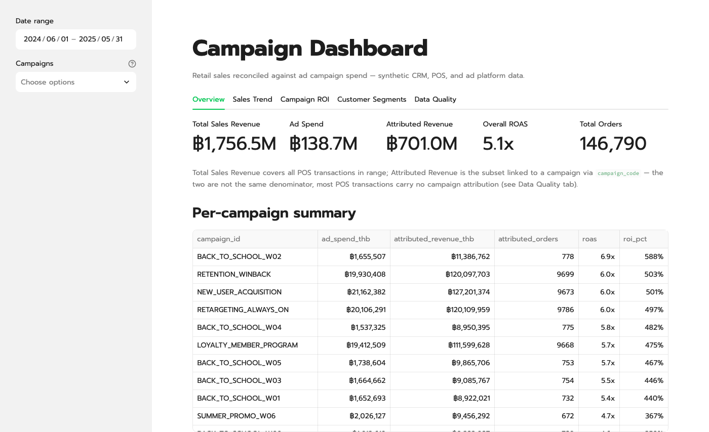
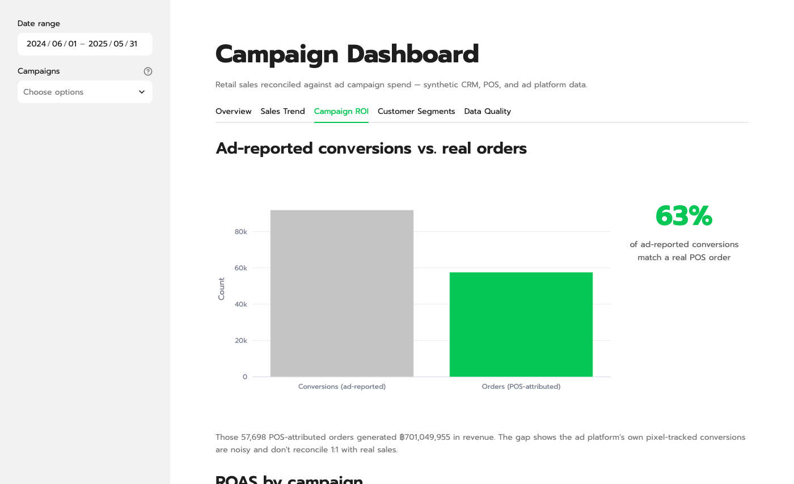

# Campaign Dashboard — reconciling messy retail data into an automated Streamlit dashboard

[](https://campaign-dashboard-hojogusrcfkpzhow56trpd.streamlit.app/)


A retail business rarely has one clean database — it has a CRM, a POS system, and an ad platform
export, each maintained by a different team, each with its own naming conventions, date formats,
and sync bugs. This project simulates exactly that: three disconnected, intentionally messy data
sources (customer master data, transaction line items, daily ad campaign performance) that have to
be profiled, cleaned, and reconciled before they can answer a business question — which campaigns
actually drove sales. The approach: audit data quality issue-by-issue, build a reusable cleaning
and reconciliation pipeline, then surface the result as an automated Streamlit dashboard.

## Preview

| Overview | Campaign ROI |
|---|---|
|  |  |

## Project Structure

```
campaign-dashboard/
├── data/
│   ├── raw/
│   │   ├── crm_customers.csv              # synthetic CRM export, 9,991 rows
│   │   ├── pos_transactions.csv           # synthetic POS export, 148,257 rows
│   │   ├── ad_platform_report.csv         # synthetic ad platform export, 4,810 rows
│   │   └── campaign_registry.csv          # short_code -> campaign_id reference table, 40 rows
│   └── processed/                          # cleaned + reconciled tables written by run_pipeline.py
├── scripts/
│   ├── generate_synthetic_data.py         # generates the 3 raw CSVs above (seeded, reproducible)
│   └── run_pipeline.py                    # runs Step 3 (cleaning) + Step 4 (reconciliation) end to end
├── src/
│   ├── cleaning.py                        # per-source cleaning & normalization rules (Step 3)
│   └── reconcile.py                       # join layer + per-campaign ROI (Step 4)
├── app.py                                  # Streamlit dashboard entry point (Step 6)
├── requirements.txt                        # Python dependencies, version-pinned
├── LICENSE
└── README.md                               # This file
```

| File / Folder | Purpose |
|---|---|
| `data/raw/*.csv` | Synthetic source data, one file per upstream system, plus `campaign_registry.csv` (short code ↔ campaign id reference table); consumed by the cleaning pipeline in `src/` |
| `data/processed/*.csv` | Cleaned per-source tables, the unified sales table, the per-campaign ROI summary, and `quality_report.json`, all written by `scripts/run_pipeline.py` |
| `scripts/generate_synthetic_data.py` | Generates the 3 raw CSVs with seeded randomness (`random.seed(42)`) — reproducible on every run |
| `scripts/run_pipeline.py` | Runs Step 3 + Step 4 end to end and prints/saves a data-quality report |
| `src/cleaning.py` | Per-source cleaning & normalization rules (Step 3) |
| `src/reconcile.py` | Join layer + per-campaign ROI (Step 4) |
| `app.py` | Streamlit dashboard entry point (Step 6) — reads `data/processed/`, does no cleaning itself |
| `requirements.txt` | Python packages required, pinned to the exact tested versions |
| `LICENSE` | MIT |
| `README.md` | This file |

## Dataset

- **Source:** Synthetic, generated by `scripts/generate_synthetic_data.py` to simulate three
  disconnected retail systems — CRM, POS/sales, and an ad platform export — with intentionally
  mismatched schemas, formats, and sync bugs.
- **Size / scope:** 3 tables, 163,058 rows total, covering a full year (2024-06-01 to 2025-05-31)
  across 40 marketing campaigns on LINE, Facebook, and Google — 4 "always-on" campaigns (new-user
  acquisition, loyalty, retargeting, winback) that run continuously, plus 4 seasonal campaign types
  (summer promo, back-to-school, flash sale, member-exclusive) that recur as 8–12 short waves spread
  across the year. Campaigns are generated programmatically from templates in
  `scripts/generate_synthetic_data.py` rather than hand-listed, so the dataset scales without
  hand-authoring dozens of near-duplicate entries.
  - `crm_customers.csv` — 9,991 rows × 9 columns
  - `pos_transactions.csv` — 148,257 rows × 12 columns
  - `ad_platform_report.csv` — 4,810 rows × 11 columns
  - `campaign_registry.csv` — 40 rows × 2 columns (short code ↔ campaign id reference table)
- **Key entities & links:** customers (`cust_id` in CRM) are referenced by POS transactions via
  `customer_ref`; POS transactions carry a campaign short code (`campaign_code`) that maps to
  `campaign_id` via `campaign_registry.csv` — the two join keys needed to connect ad spend to
  actual sales.

### Data quality issues found (profiling complete — cleaning rules implemented in Step 3 below)

- **`crm_customers.csv`** — 454 missing/invalid emails, 1,226 missing/unmapped segments, 799 missing
  `total_lifetime_orders` (182 more stored negative, a data-entry error); `customer_segment` has 14
  distinct raw values for 3 real categories (`VIP`, `vip`, ` VIP `, `1`/`2`/`3` legacy numeric codes);
  `region` has 41 distinct raw values for 5 real regions (`Bangkok`, ` bangkok `, `BKK`, `กรุงเทพ`); 4
  mixed date formats in `signup_date`; 194 duplicate `cust_id` values with conflicting data (merge
  error) plus 97 exact full-row duplicates.
- **`pos_transactions.csv`** — 22,149 missing `customer_ref` (walk-in sales, expected) plus an
  unknown number of orphan references that don't exist in CRM (bad sync); 87,909 missing
  `campaign_code` (transaction not attributed to a campaign); 12,430 missing `store_channel`;
  `unit_price` stored as comma-formatted strings; 2,932 rows priced in USD instead of THB without
  conversion; 2,929 negative-quantity rows (returns, expected); 14 distinct raw values for 4 real
  `payment_method` categories; 1,467 duplicate `transaction_id` rows (system retry).
- **`ad_platform_report.csv`** — `impressions`/`clicks` stored as comma-formatted strings, `ctr`
  stored as a percent string (35 missing/unparseable); 170 rows in USD instead of THB; 27 rows with
  negative `spend_thb` (billing adjustments, expected); 9 distinct raw values for 3 real `platform`
  names (`LINE`, `Line`, `line`, `GOOGLE_ADS`); 35 tracking anomalies where `impressions` collapses
  to 0 but `clicks` persists; 68 duplicate daily exports (overlapping manual + scheduled export).

## Environment Setup

Requires **Python 3.11+** (`pandas==3.0.5` has no wheels for older versions):
```bash
python3 -m venv .venv
source .venv/bin/activate
pip install -r requirements.txt
```

Regenerates the 3 raw CSVs in `data/raw/`:
```bash
python3 scripts/generate_synthetic_data.py
```
Runs Steps 3–4 (cleaning + reconciliation), prints a data-quality report, and writes the cleaned +
reconciled tables to `data/processed/` — **run this at least once before launching the dashboard**:
```bash
python3 scripts/run_pipeline.py
```
Launches the dashboard (reads only from `data/processed/`, so re-run the pipeline first after any
change to the raw data or cleaning rules):
```bash
streamlit run app.py
```

## Methodology

The project proceeds in two stages: first turning the three raw exports into one trustworthy,
reconciled dataset, then surfacing it as a live dashboard. Steps 1–5 are complete and grounded in
the profiling and pipeline run above; steps 6 onward are planned and will be filled in with real
numbers as each is implemented.

### Step 1: Data ingestion *(done)*
Loads the 3 raw source files that stand in for a CRM, POS, and ad-platform export. For portfolio
purposes these are synthetically generated by `scripts/generate_synthetic_data.py` with a fixed
random seed, so the raw dataset is reproducible on every run.

**Findings / Result:**
- `crm_customers.csv`: 9,991 rows, `pos_transactions.csv`: 148,257 rows, `ad_platform_report.csv`: 4,810 rows
- 163,058 total rows across all 3 sources, plus a 40-row `campaign_registry.csv` reference table

### Step 2: Exploratory data analysis & data quality audit *(done)*
Profiles each raw file for nulls, duplicates, inconsistent categorical values, mixed formats, and
currency/unit inconsistencies — the findings feed directly into the cleaning rules in Step 3.

**Findings / Result:**
- See "Data quality issues found" above — the concrete list of every issue and its scope.

### Step 3: Cleaning & normalization pipeline *(done)*
Per-source cleaning rules in `src/cleaning.py`: unify date formats, convert USD rows to THB,
collapse duplicate categorical spellings (incl. Thai-script and legacy numeric-code variants) to a
canonical value via explicit alias tables, dedupe rows, and flag rather than drop expected-but-messy
cases (returns, billing adjustments, tracking anomalies) so downstream steps can decide what to do
with them.

**Findings / Result** (`python3 scripts/run_pipeline.py`):
- `crm_customers.csv`: 9,991 → 9,700 rows (97 exact duplicates + 194 conflicting-duplicate `cust_id`
  rows dropped, keeping the most complete record per id); 454 missing/invalid emails; 1,226
  missing/unmapped segments; 182 negative `total_lifetime_orders` corrected to positive; 799 still
  missing after cleaning; all 41 raw region spellings mapped cleanly to 5 canonical regions.
- `pos_transactions.csv`: 148,257 → 146,790 rows (1,467 duplicate `transaction_id` rows dropped);
  2,932 USD rows converted to THB; 556 out-of-range `discount_pct` values clipped to [0, 100];
  2,929 return rows flagged (`is_return`) rather than dropped; 12,430 store channels unmapped after
  normalization; 87,909 rows have no campaign attribution (expected — only ~40% of campaign-window
  transactions carry a code); 22,149 walk-in rows with no `customer_ref`.
- `ad_platform_report.csv`: 4,810 → 4,742 rows (68 duplicate daily exports dropped, matched on
  campaign/date/platform/notes so real adjustment and anomaly rows aren't collapsed); 170 USD rows
  converted to THB; 35 rows had an unparseable `ctr` and were recomputed from clicks/impressions; 27
  negative-spend billing-adjustment rows and 35 tracking-anomaly rows flagged, not dropped.

### Step 4: Reconciliation / join layer *(done)*
`src/reconcile.py` joins POS transactions to CRM customers via `customer_ref` → `cust_id`, and to
the ad platform report via `campaign_code` → `campaign_id` (using `campaign_registry.csv`, since
neither raw export carries both keys), then rolls the joined result up into a per-campaign ROI
table (ad spend vs. attributed sales, returns excluded).

**Findings / Result:**
- 3,764 POS rows reference a `customer_ref` that doesn't exist in CRM (orphan references — bad
  sync, flagged not dropped); all 40 `campaign_code` values mapped cleanly to a `campaign_id` via
  `campaign_registry.csv`.
- Per-campaign ROAS ranges from ~1.3x (`FLASH_SALE_W12`) to ~6.9x (`BACK_TO_SCHOOL_W02`) across all
  40 campaigns, overall ROAS ~5.1x — a believable spread; ad budgets in
  `scripts/generate_synthetic_data.py` are calibrated against this dataset's POS revenue scale
  (including a higher budget for "always-on" campaigns, which rack up disproportionate attribution
  simply by running every day of the year) so no campaign shows an unrealistic double-digit ROAS.
  See `data/processed/campaign_summary.csv` for the full table.
- Only **63%** of ad-reported `conversions_reported` reconcile to a real POS-attributed order
  (91,968 reported vs. 57,698 real) — `scripts/generate_synthetic_data.py` grounds reported
  conversions in the true order count per campaign/day with a randomized 1.3x–2x over-count factor,
  simulating the pixel-tracking overcounting that server-side reconciliation is meant to catch.

### Step 5: Pipeline automation *(done)*
`scripts/run_pipeline.py` wraps Steps 3–4 into a single re-runnable script: dropping new files into
`data/raw/` and re-running it reprocesses everything and rewrites `data/processed/` with no manual
steps in between.

### Step 6: Streamlit dashboard *(done)*
`app.py` reads only from `data/processed/` (no cleaning logic lives in the dashboard) and renders 5
tabs: KPI overview, sales trend, campaign ROI, customer segment breakdown, and a data-quality report
page sourced directly from `quality_report.json` — so the "what was cleaned" numbers can never drift
from what the pipeline actually did. A sidebar date-range and campaign filter applies across the
Overview/Trend/Segment tabs.

**Result:** verified locally with `streamlit run app.py` — all 5 tabs render, 7 charts + 5 tables
populate, zero exceptions and zero browser console errors, including at the current 40-campaign /
163,058-row scale.

### Step 7: Deployment *(done)*
Pushed to GitHub and deployed via Streamlit Community Cloud:
**[campaign-dashboard-hojogusrcfkpzhow56trpd.streamlit.app](https://campaign-dashboard-hojogusrcfkpzhow56trpd.streamlit.app/)**

**Gotcha hit during first deploy:** Streamlit Community Cloud does not honor a `runtime.txt`
Python-version pin — it always provisions whatever its current default Python is (3.14 as of this
deploy), regardless of that file. The original pins (`pandas==2.3.3`, `numpy==1.24.3`,
`streamlit==1.38.0`) predate Python 3.14 wheel availability for several transitive dependencies
(numpy, pillow), so the build failed trying to compile them from source. Fix: bump `requirements.txt`
to versions with prebuilt wheels for the Python Cloud actually runs (`pandas==3.0.5`,
`numpy==2.5.2`, `streamlit==1.62.0`, `plotly==6.9.0`), verified locally on Python 3.14 first —
pipeline output and dashboard render identically to the older pins. The local dev `.venv` now also
runs Python 3.14 to match Cloud and avoid this drifting again.

## Status

- [x] Stage 1 — Data ingestion & exploratory data analysis (3 raw datasets, 163,058 rows, quality issues catalogued)
- [x] Stage 2 — Cleaning, reconciliation & pipeline automation (`src/cleaning.py`, `src/reconcile.py`, `scripts/run_pipeline.py`)
- [x] Stage 3 — Streamlit dashboard build & deployment (`app.py`, live on Streamlit Community Cloud)

All 7 steps are complete and live:
**[campaign-dashboard-hojogusrcfkpzhow56trpd.streamlit.app](https://campaign-dashboard-hojogusrcfkpzhow56trpd.streamlit.app/)**
